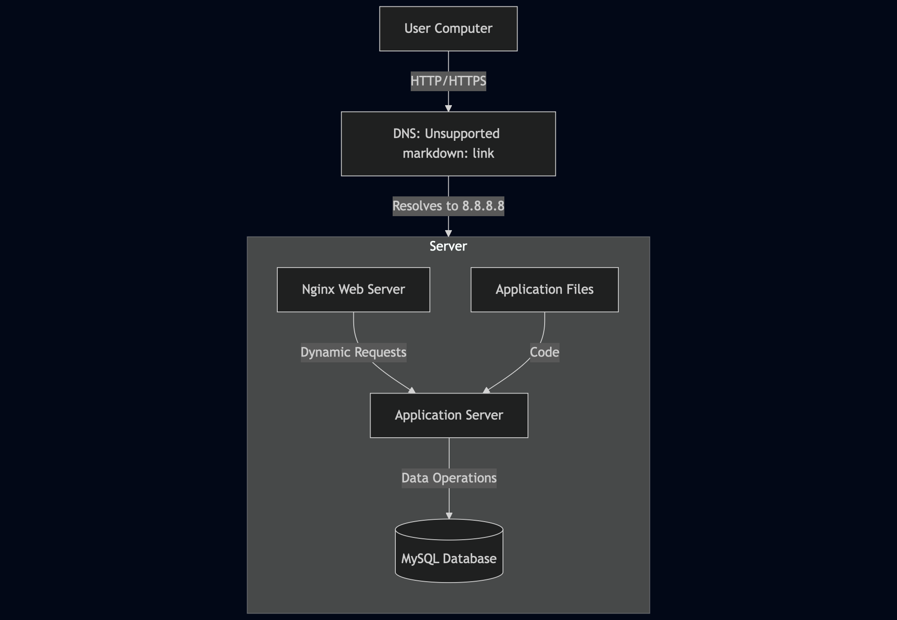

# Simple Web Stack

## Infrastructure Components

1. **Domain Name:** foobar.com
   - www record pointing to server IP 8.8.8.8
   - **Role:** Provides a human-readable address for the website
   - **DNS Record Type:** The 'www' in www.foobar.com is a CNAME record that points to the domain foobar.com

2. **Server Components:**
   - **Web Server (Nginx):**
     - Serves static content and forwards dynamic requests to the application server
     - Handles HTTP/HTTPS requests
     - Manages SSL/TLS encryption
   - **Application Server:**
     - Processes dynamic requests and executes application code
     - Runs the business logic of the application
     - Communicates with the database
   - **Application Files:**
     - Contains the website's codebase
     - Stores all the application code and assets
   - **Database (MySQL):**
     - Stores and manages website data
     - Handles data persistence
     - Manages data relationships and queries

3. **Communication:**
   - HTTP/HTTPS protocol used between user's computer and server
   - TCP/IP for network communication
   - Port 80 (HTTP) or 443 (HTTPS) for web traffic

## Infrastructure Explanation

1. **What is a server?**
   - A server is a computer or system that provides resources, data, services, or programs to other computers, called clients, over a network.
   - In this case, it's a physical or virtual machine running the web stack.

2. **What is the role of the domain name?**
   - Provides a human-readable address for the website.
   - Maps to the server's IP address through DNS.
   - Makes the website easily accessible to users.

3. **What type of DNS record www is in www.foobar.com?**
   - CNAME (Canonical Name) record.
   - Points www.foobar.com to foobar.com.
   - Allows multiple domain names to point to the same server.

4. **What is the role of the web server?**
   - Serves static content (HTML, CSS, images).
   - Handles HTTP/HTTPS requests.
   - Forwards dynamic requests to the application server.
   - Manages SSL/TLS encryption.

5. **What is the role of the application server?**
   - Executes the application code.
   - Processes dynamic requests.
   - Manages business logic.
   - Communicates with the database.

6. **What is the role of the database?**
   - Stores and manages website data.
   - Handles data persistence.
   - Manages data relationships.
   - Processes database queries.

7. **What is the server using to communicate with the computer of the user requesting the website?**
   - HTTP/HTTPS protocol
   - TCP/IP for network communication
   - Port 80 (HTTP) or 443 (HTTPS)

## Infrastructure Issues

1. **Single Point of Failure (SPOF):**
   - If the server goes down, the entire website becomes unavailable.
   - No redundancy or backup systems.

2. **Maintenance Downtime:**
   - Server needs to be restarted for updates/maintenance.
   - Website becomes unavailable during these periods.
   - No way to perform maintenance without affecting users.

3. **Scalability Issues:**
   - Single server cannot handle high traffic loads.
   - No load balancing or redundancy.
   - Limited by server's hardware resources.

## Whiteboard Diagram

 