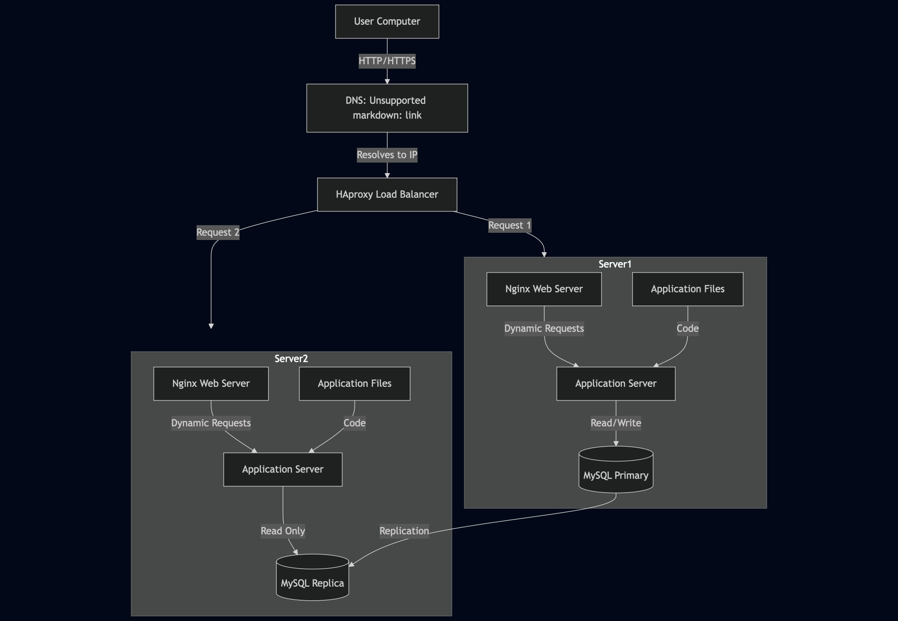

# Distributed Web Infrastructure

## Infrastructure Components

1. **Load Balancer (HAproxy)**
   - **Role:** Distributes incoming traffic across multiple servers
   - **Distribution Algorithm:** Round Robin
     - Works by distributing requests sequentially to each server in the pool
     - Each server gets an equal number of requests
     - Simple and effective for servers with similar capabilities
   - **Setup:** Active-Active
     - Both servers are actively handling requests
     - Provides better performance and resource utilization
     - If one server fails, the other continues handling all traffic
     - **Difference from Active-Passive:**
       - Active-Passive: One server handles all traffic while the other remains idle as backup
       - Active-Active: Both servers share the load, providing better performance

2. **Web Servers (2x Nginx)**
   - **Role:** Serve static content and forward dynamic requests
   - **Benefits of having two:**
     - Redundancy: If one fails, the other can handle traffic
     - Load distribution: Traffic is split between servers
     - Better performance: Reduced load per server

3. **Application Servers (2x)**
   - **Role:** Process dynamic requests and execute application code
   - **Benefits of having two:**
     - Redundancy: If one fails, the other can handle requests
     - Load distribution: Processing is split between servers
     - Better performance: Reduced load per server

4. **Application Files (2x)**
   - **Role:** Store the website's codebase
   - **Benefits of having two sets:**
     - Redundancy: If one set is corrupted, the other is available
     - Consistency: Both servers run the same code version
     - Faster deployment: Can update one server while the other serves traffic

5. **Database (MySQL Primary-Replica)**
   - **Primary Node (Master):**
     - Handles all write operations
     - Maintains the primary copy of the data
     - Can handle read operations
   - **Replica Node (Slave):**
     - Handles read operations
     - Maintains a copy of the primary data
     - Provides redundancy and read scalability
   - **How it works:**
     - Primary node handles all write operations
     - Changes are replicated to the replica node
     - Replica node can handle read operations
     - If primary fails, replica can be promoted to primary

## Infrastructure Issues

1. **Single Points of Failure (SPOF):**
   - Load Balancer: If it fails, no traffic distribution
   - Database Primary: If it fails, no write operations
   - No backup power supply
   - No backup internet connection

2. **Security Issues:**
   - No firewall to protect the infrastructure
   - No HTTPS implementation
   - No SSL/TLS encryption
   - No DDoS protection
   - No intrusion detection system

3. **Monitoring Issues:**
   - No monitoring system in place
   - No alert system for failures
   - No performance monitoring
   - No resource usage tracking
   - No error logging system

## Whiteboard Diagram

 