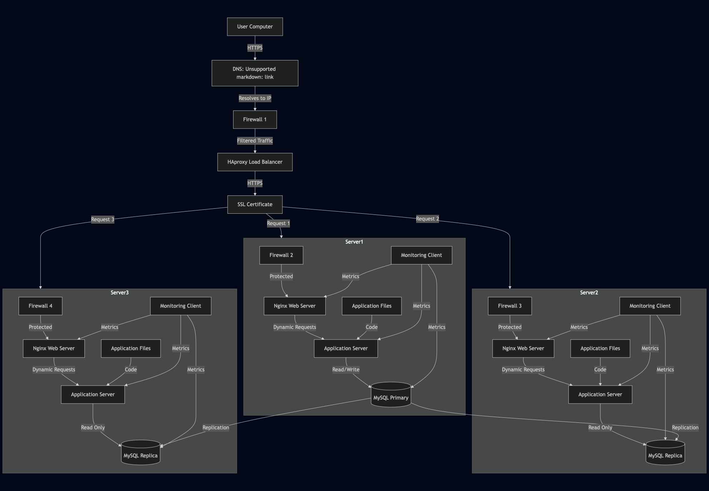

# Secured and Monitored Web Infrastructure

## Infrastructure Components

1. **Firewalls (3x)**
   - **Role:** Network security systems that monitor and control incoming/outgoing traffic
   - **Locations:**
     - Load Balancer Level: Protects against DDoS and filters traffic
     - Web Server Level: Controls access to web servers
     - Database Level: Restricts database access
   - **Why added:** To implement defense in depth and protect each layer

2. **SSL Certificate**
   - **Role:** Enables HTTPS encryption for www.foobar.com
   - **Implementation:** SSL termination at load balancer
   - **Why added:** To encrypt data in transit and protect user information

3. **Monitoring Clients (3x)**
   - **Role:** Collect system and application metrics
   - **Implementation:** Data collectors for Sumologic (or similar)
   - **Why added:** To track performance, detect issues, and ensure system health

## Infrastructure Explanation

1. **Firewalls**
   - **Purpose:**
     - Control network traffic
     - Block unauthorized access
     - Prevent DDoS attacks
     - Implement security policies
   - **Types:**
     - Network Firewall: At load balancer level
     - Host-based Firewall: On each server
     - Database Firewall: For database protection

2. **HTTPS Traffic**
   - **Purpose:**
     - Encrypt data in transit
     - Protect user information
     - Prevent man-in-the-middle attacks
     - Ensure data integrity
   - **Implementation:**
     - SSL certificate installed on load balancer
     - All traffic encrypted between user and load balancer
     - Internal traffic can be unencrypted

3. **Monitoring System**
   - **Purpose:**
     - Track system performance
     - Detect issues early
     - Monitor resource usage
     - Alert on problems
   - **Data Collection:**
     - System metrics (CPU, memory, disk)
     - Application metrics (response times, errors)
     - Network metrics (bandwidth, latency)
     - Security events
   - **Web Server QPS Monitoring:**
     - Collect request counts per second
     - Monitor response times
     - Track error rates
     - Set up alerts for thresholds

## Infrastructure Issues

1. **SSL Termination at Load Balancer**
   - **Issues:**
     - Traffic between load balancer and servers is unencrypted
     - Potential security risk in internal network
     - Single point of failure for SSL
   - **Solution:**
     - Implement end-to-end encryption
     - Use SSL certificates on each server
     - Consider SSL passthrough

2. **Single MySQL Write Server**
   - **Issues:**
     - Single point of failure
     - Limited scalability
     - No redundancy for write operations
   - **Solution:**
     - Implement MySQL replication
     - Use multiple write-capable servers
     - Consider sharding for large datasets

3. **Identical Server Components**
   - **Issues:**
     - Resource contention
     - Complex maintenance
     - Difficult scaling
     - Single point of failure for each component
   - **Solution:**
     - Separate components into dedicated servers
     - Implement proper load balancing
     - Use specialized servers for each role

## Whiteboard Diagram

 