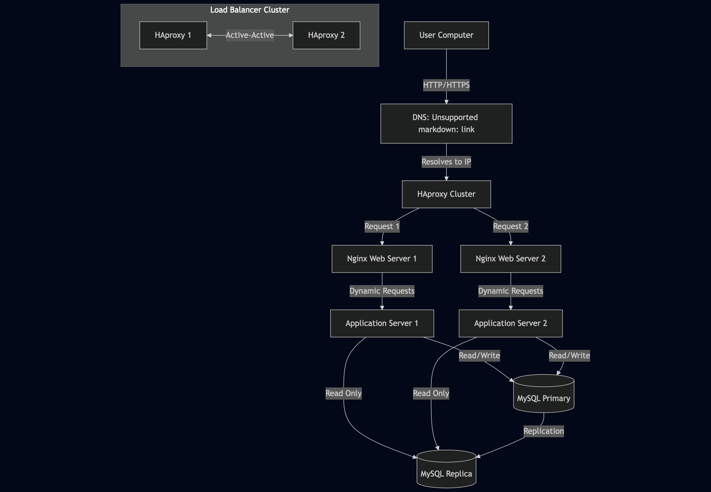

# Scale Up Infrastructure

## Infrastructure Components

1. **Load Balancers (HAproxy Cluster)**
   - **Role:** Distribute traffic across web servers
   - **Configuration:** Active-Active cluster
   - **Why added:**
     - High availability for load balancing
     - No single point of failure
     - Better traffic distribution
     - Automatic failover

2. **Web Servers (2x Nginx)**
   - **Role:** Serve static content and forward dynamic requests
   - **Why separated:**
     - Dedicated resources for static content
     - Better performance for static file serving
     - Easier scaling of web layer
     - Independent maintenance

3. **Application Servers (2x)**
   - **Role:** Process dynamic requests and execute application code
   - **Why separated:**
     - Dedicated resources for application logic
     - Better performance for dynamic content
     - Easier scaling of application layer
     - Independent maintenance

4. **Database Servers**
   - **Primary Server:** Handles write operations
   - **Replica Servers:** Handle read operations
   - **Why separated:**
     - Dedicated resources for database operations
     - Better performance for data operations
     - Easier scaling of database layer
     - Independent maintenance

## Component Separation Benefits

1. **Web Server vs Application Server**
   - **Web Server (Nginx):**
     - Serves static content (HTML, CSS, images)
     - Handles SSL/TLS termination
     - Manages HTTP/HTTPS requests
     - Forwards dynamic requests to application server
   - **Application Server:**
     - Executes application code
     - Processes business logic
     - Manages database operations
     - Handles dynamic content generation

2. **Resource Optimization**
   - Each component can be scaled independently
   - Resources allocated based on specific needs
   - Better performance for each layer
   - Easier maintenance and updates

3. **High Availability**
   - No single point of failure
   - Components can fail independently
   - Automatic failover for load balancers
   - Redundancy at each layer

## Infrastructure Flow

1. **User Request Flow:**
   - User → DNS → Load Balancer Cluster
   - Load Balancer → Web Server
   - Web Server → Application Server
   - Application Server → Database

2. **Response Flow:**
   - Database → Application Server
   - Application Server → Web Server
   - Web Server → Load Balancer
   - Load Balancer → User

## Scaling Benefits

1. **Horizontal Scaling**
   - Add more web servers for static content
   - Add more application servers for processing
   - Add more database replicas for reads

2. **Vertical Scaling**
   - Increase resources for each component
   - Optimize each server for its specific role
   - Better resource utilization

3. **Maintenance**
   - Update components independently
   - No downtime for updates
   - Easier troubleshooting
   - Better monitoring per component

## Whiteboard Diagram

 