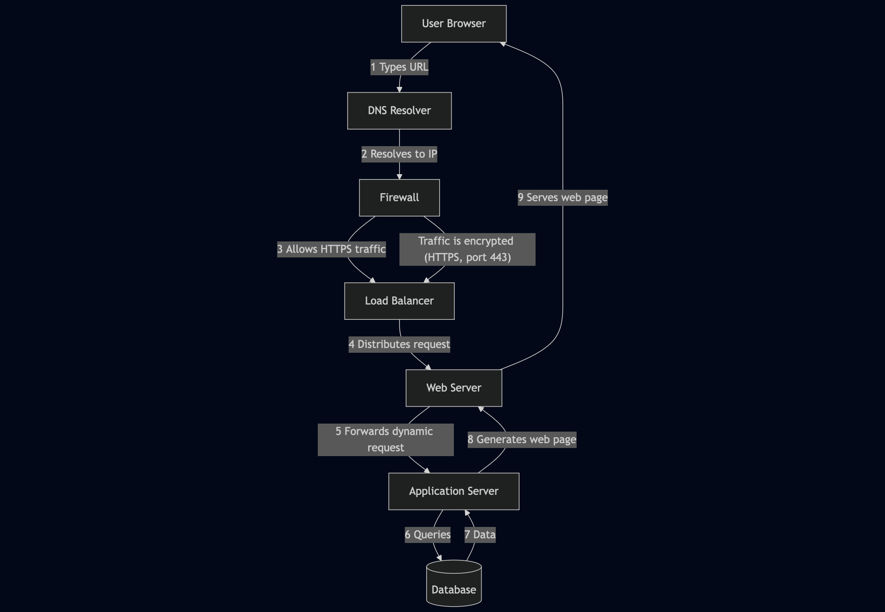
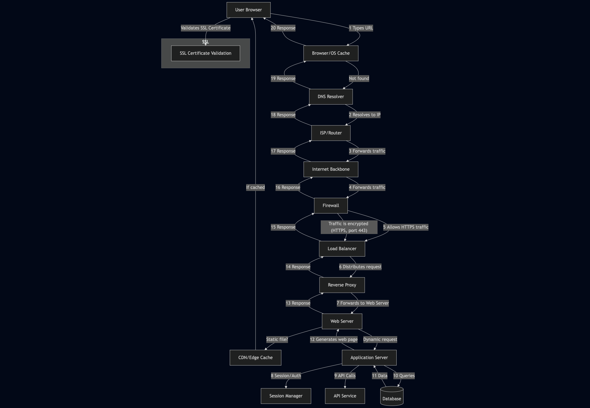

🌐 What Really Happens When You Type https://www.google.com and Hit Enter?

Every day, we open a browser, type a URL, and press Enter—expecting magic to happen. But have you ever wondered what really goes on behind the scenes?

From DNS resolution to encrypted communication and database lookups, here's a deep dive into what happens when you type https://www.google.com in your browser and hit Enter. This knowledge is essential for software engineers, system administrators, and curious developers.

🧭 1. DNS Lookup: Finding Google's IP Address
When you type a domain name, like www.google.com, your browser needs to figure out which IP address it corresponds to.

Here's how that happens:

Browser Cache – It first checks if it recently resolved this domain.
Operating System Cache – If not found, the OS checks its own cache.
DNS Resolver – If still unresolved, a query is sent to a DNS server (usually your ISP's or a public one like 8.8.8.8).
Recursive Lookup – If necessary, the resolver asks root, TLD (.com), and authoritative servers until it gets the IP.
✅ Now we know that www.google.com maps to something like 142.250.190.4.

🔌 2. TCP/IP: Making the Connection
With the IP address in hand, your computer now opens a TCP connection to Google's server over port 443 (HTTPS).

This uses the TCP three-way handshake:

SYN →
SYN-ACK ←
ACK →
With the handshake done, a reliable connection is established over the Internet Protocol (IP), forming the TCP/IP stack.

🔥 3. Firewall: Is This Allowed?
Before the data leaves your computer:

Your local firewall checks if this type of request is permitted.
Your router/firewall may also inspect it.
On the server side, Google's firewall only allows secure traffic (e.g., on port 443).

🔐 4. HTTPS & SSL/TLS: Securing the Channel
Now it's time to secure the connection using TLS (Transport Layer Security):

Your browser sends a ClientHello with supported encryption methods.
Google replies with a certificate signed by a trusted Certificate Authority (CA).
Both sides agree on an encryption algorithm and generate session keys.
The browser validates the certificate (using the CA chain) and encrypts the session.
🔒 From here on, all communication is secure—preventing eavesdropping or tampering.

⚖️ 5. Load Balancer: Choosing the Best Server
Google operates thousands of servers worldwide.

Your request hits a load balancer that:

Analyzes traffic conditions.
Checks server health.
Redirects your request to the optimal server, often close to you geographically.
Load balancing helps with:

High availability
Failover
Scalability

🖥 6. Web Server: Handling the Request
The selected server receives your HTTPS request. It first hits a web server, such as:

NGINX
Apache
Google's custom web stack
This layer:

Serves static files (HTML, images).
Routes dynamic requests to an application server.

🧠 7. Application Server: Generating the Response
Next, your request reaches the application server.

This layer processes logic such as:

Interpreting user input (search terms).
Managing sessions or preferences.
Calling APIs or services.
Google's app servers may be written in Go, C++, Python, or other high-performance languages.

🗃 8. Database: Querying the Data
If the request requires stored data (e.g., recent searches or personalized content), the application queries Google's databases:

Bigtable
Spanner
Colossus
These distributed systems handle:

Billions of queries
Real-time indexing
Low-latency access
The response is then passed back up the stack.

🖼 9. The Response: Rendering in the Browser
Finally, the full response returns to your browser via the secure HTTPS connection. The browser:

Parses the HTML.
Downloads and applies CSS styles.
Executes JavaScript.
Builds and renders the DOM (Document Object Model).
Displays the final page to you.

🎉 You see the Google homepage (or your search results), all in a fraction of a second.

🧩 Recap: The Full Journey in Steps

Step	Description
1	DNS resolves the domain to an IP
2	TCP/IP establishes a connection
3	Firewalls approve the request
4	TLS encrypts the communication
5	Load balancer routes the request
6	Web server handles HTTP logic
7	Application server processes it
8	Database fetches necessary data
9	Browser renders the final result

🧠 Why This Matters

This entire process illustrates just how complex and beautiful modern networking is. Each layer—from DNS to rendering—is optimized for speed, security, and resilience.

Understanding this flow:

Improves debugging skills
Helps in optimizing web apps
Prepares you for technical interviews

📝 Want to Learn More?

Some great topics to explore next:

CDN and edge caching
TLS 1.3 and zero-RTT
HTTP/2 vs HTTP/3
Load balancing algorithms

## Request Flow Diagram

## Detailed Request Flow Diagram

For a more comprehensive view, see the following detailed diagram:

## Author

**Adolfo Rodriguez**

- [GitHub Profile](https://github.com/Adolfo2231)
- [LinkedIn](https://www.linkedin.com/in/adolfo-rodriguez-22b178330/)